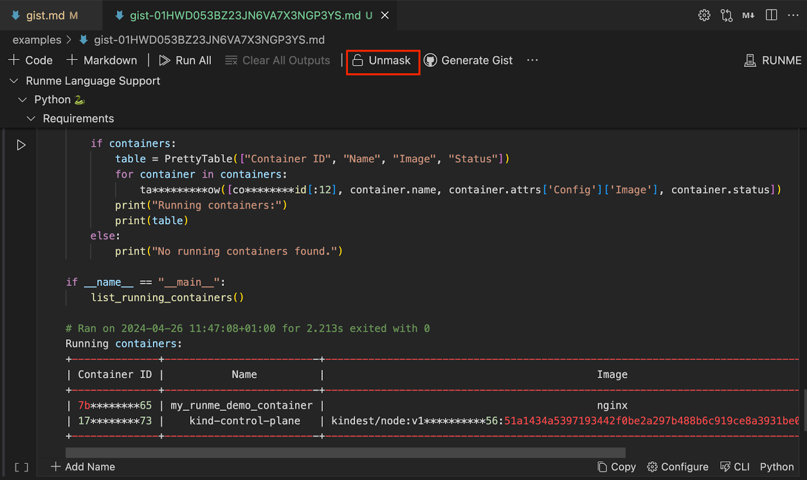
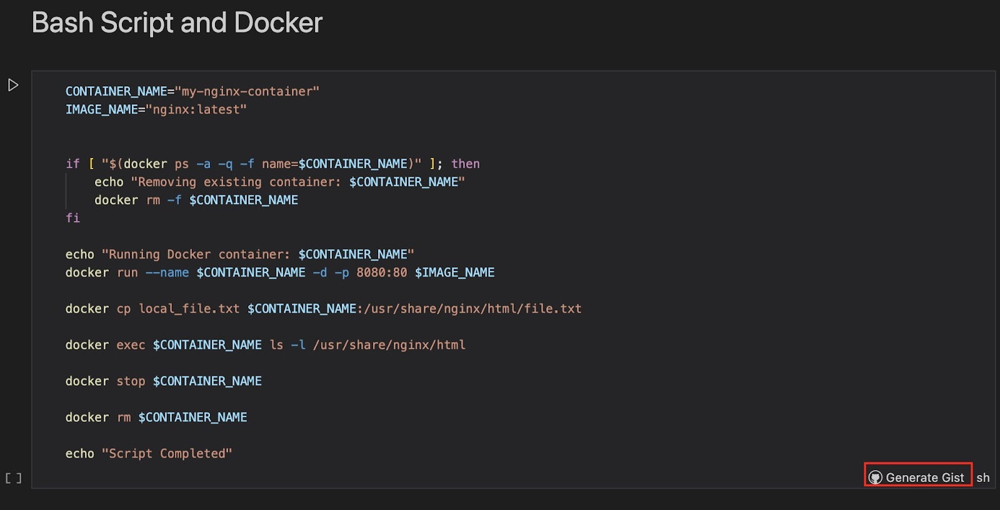

---
runme:
  id: 01HX525D9CNEBFG0X788KGMB9E
  version: v3
---

# Runme Gist

Would you like to share or store your plain texts or code snippets securely with others in your team without needing a full repository or document?

Runme Gist makes this possible and prioritizes your information's sensitivity by keeping sensitive information secret. In this section, we will explain how you can use Runme Gist to generate gist and share your texts and code.

## **What is Runme Gist?**

Runme Gist combines [GitHub Gist](https://gist.github.com/) with Runme features to run, share, and store plain texts or code snippets in your Markdown file. What makes Runme Gist powerful is its ability to capture outputs and mask sensitive data without copying and pasting or integrating a third-party tool. All is done right within your Markdown file.

## **Installation**

To utilize the Runme Gist feature, set up the following Runme tools.

- Install the [Runme extension](../installation/installrunme) in your VS Code If you already have Runme installed in your VS Code, ensure you are upgraded to the latest version `v3.4.0`.
- Set Runme as your [default Markdown viewer](../installation/installrunme) to ensure all Markdown files in your code editor are automatically opened as a Runme notebook.

## **Setting Up Runme Gist**

As stated earlier, Runme Gist combines [GitHub Gist](https://gist.github.com/) with Runme features to enable you to securely run, share, and store code snippets. This section will explain how Runme Gist works using a step-by-step guide.

**Step 1: Open your Markdown File**

Create a `README.md` file and open it in your VS Code. If you already have the file you want to use, open it in VS Code.

**Step 2: Activate Auto-Save**
As part of the requirements to generate a gist, you need to activate the [auto-save feature](../configuration/auto-save) of Runme. This ensures your outputs are saved automatically without manual intervention.

**Step 3: Run Cells**

Now, run your notebook cells. A separate file containing your saved output will be automatically generated, known as “Session Outputs.”

**Step 4: View Sessions Output**

Session Output is a Runme feature that stores your generated cell outputs in a separate file so you can access them whenever necessary. See the [Session output](../configuration/auto-save#session-outputs) guide.

To view your Session Output, click “Sessions Outputs” to inspect the locally recorded session. Alternatively, you can find it on the left-hand side of your VS Code right inside your current working directory.

The Session Outputs feature is only available when the autosave is enabled and the Runme cell is run.

**Step 5: Toggle Between Mask and Unmask**

You can decide if you want your Session Outputs to be masked or unmasked.
The masked and unmasked options are how Runme keeps your sensitive information secret. If you want to keep your sensitive information secret, you should toggle the mask option otherwise, choose the unmasked option.
By default, Runme uses the open-source `data-guardian` to mask sensitive information on a best-effort basis.

## **Creating and Managing Gist with Runme using Secret Gists**

GitHub Gist is a service provided by GitHub that allows users to share code snippets, notes, and other small pieces of text with others. Using two methods, you can push your Runme Session Output to GitHub Gist from your Markdown file with a single click.

### Generate Gist for the Entire Markdown File

You can generate a Gist for your entire Markdown file. To do this, in your Session Outputs file, click on ‘Generate Gist’.

Runme will first prompt you to log into your GitHub account and grant write access to your Gist. After a successful login, a notification containing a link to the Runme Gist hosted on your GitHub will be displayed. The link is generated as a “Secret Gist,” which will stay private as long as you keep it private. Ensure you secure the link cautiously before pushing your sessions to GitHub Gist.

Lastly, use the Runme mask feature to keep your sensitive pieces secured.

## **Visual Representation of Runme Gist**

Here is a video that showcases how to generate Runme Gist for your entire Markdown file

<video autoPlay loop muted playsInline controls>
  <source src="/videos/Runme-gist.mp4" type="video/mp4" />
  <source src="/videos/Runme-gist.webm" type="video/webm" />
</video>

## **Generate Gist Per Cell**

Alternatively to generating Gist for the entire Markdown file, you can generate gist for each cell in your Markdown file. To do this, in your Session Outputs file, navigate to the cell you want to be generated as  a gist and click on ‘Generate Gist’.

Congratulations! You have successfully learned how to use the Runme Gist feature.

**Note that Session Output files can be kept offline and locally**.

You can read about that [here](https://runme.dev/blog/runme-v3-pipeline-logs-and-artifacts). If you love this feature, kindly give [Runme a star](https://github.com/stateful/runme/stargazers) on GitHub.

