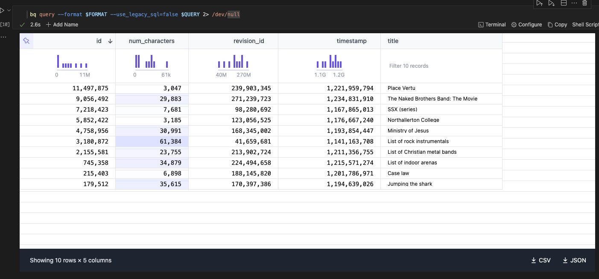
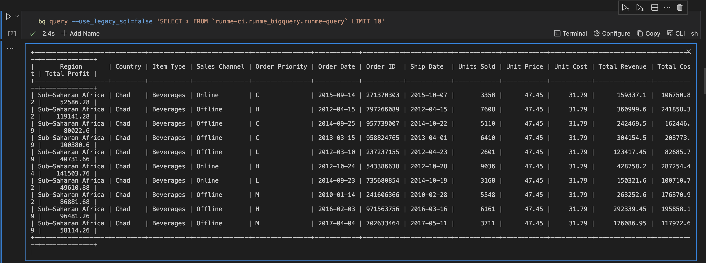

---
runme:
  id: 01J2B937J9DH0TPAHSSRB76X1G
  version: v3
---

# Manage Data Queries with BigQuery and Runme

Runme simplifies the management and execution of tasks while documenting your process. With Runme, you can integrate with BigQuery to run queries easily and efficiently.

In this guide, you will learn how to manage data queries using BigQueris and Runme.

### Prerequisites

To follow up on this guide, ensure you have the following:

**Install Runme Extension and Make it Your Default Markdown Viewer**

Install the [Runme extension](https://marketplace.visualstudio.com/items?itemName=stateful.runme) in your VS Code editor. Runme also provides other [client interfaces](../installation/index.md) where you can run your Markdown file. Once installed, make Runme your [default Markdown viewer](../installation/installrunme#how-to-set-vs-code-as-your-default-markdown-viewer).

**Google Cloud SDK**

Install Google Cloud SDK to interact with Google Cloud resources. To install it, run the command below.

```sh {"id":"01J2B9V1NA28V0KFGPAYZP10V0"}
brew install --cask google-cloud-sdk
```

If you are using any other platform, see the [GCP's official docs](https://cloud.google.com/sdk/docs/install) to learn how to install Google Cloud SDK for your specific platform.

## Authenticate with Google Cloud

The first step to take is to authenticate your Google Cloud account using the `gcloud auth` feature, which allows you to have access to Google Cloud resources. To do this, run the command below:

```sh {"id":"01J2B937J9DH0TPAHSRX57KFSZ"}
gcloud auth login
```

Once this command is executed, a browser window will open where you can log in with your Google account. After logging in, you can explore the Gcloud components.

**List Available Components**

To list all available or installed components of your Google Cloud SDK, run the command below.

```sh {"id":"01J2B937J9DH0TPAHSS05NY5CD"}
gcloud components list
```

When the command is executed successfully, you will see a list of all available components, similar to the image below.


**Update Google Cloud Components**

After getting a list of all available and installed components, you may want to update them. To do that, run the command below.

```sh {"id":"01J2B937J9DH0TPAHSS26D4ST8"}
gcloud components update
```

**Install the BigQuery Component**

With the authentication completed, you can proceed to install your BigQuery component. Run the command below to do that.

```sh {"id":"01J2B937J9DH0TPAHSS5X947XP"}
gcloud components install bq
```

### Set Your Project

Now, you have successfully completed the authentication phase. The next step is to set up your project.

To do that, you first need to set up your Google Cloud project ID using the [Runme Environment Variable Prompt](../getting-started/features#environment-variable-prompts). This allows you to specify the project you want to work on within your notebook. To set your project ID, run the command below:

```sh {"id":"01J2B992A1G2K3PT40FDHV4QZ9"}
export PROJECT_ID="runme-ci"
echo "PROJECT_ID set to $PROJECT_ID"
```

> Replace `runme-ci` with the ID of your project.

Next, Configure the `gcloud` CLI to use your specific Google Cloud project. Run the command below to do that.

```sh {"id":"01J2B937J9DH0TPAHSS7M7C8P5"}
gcloud config set project $PROJECT_ID
```

## BigQuery Operations

In this section, we will explore various BigQuery operations.

## Query a Dataset With Runme

With Runme features, you can successfully run and display your query's output, formatting it into a table for easy navigation.

To do this, you first need to set your `FORMAT`. Using [Runme’s environment variable](../configuration/cell-level#set-environment-variables), you will be prompted to set the `FORMAT`. Run the command below in your code cell.

```sh {"id":"01J2KDSN92SZZYTSN11D7GS2G9"}
export FORMAT="json"
echo "FORMAT set to ${FORMAT}"
```

The next step is to execute your query.

To do this, set the code cell [programming language](../configuration/shebang.md) to **SQL** and also give your [code cell a name.](../configuration/cell-level#unnamed-vs-named-cells) For this example, we will call our code cell **QUERY**. Run the command below.

```sql {"id":"01J2KDYDZHSYQW5M78AVG3NN1P","name":"QUERY"}
SELECT title, num_characters, timestamp, id, revision_id FROM
  `bigquery-public-data.samples.wikipedia`
WHERE num_characters < 67100
LIMIT 10;
```


Next, run the command below while disabling the [interactive mode](../getting-started/features#interactive-mode) of the code cell.

```sh {"id":"01J2KDZ0Z374808DNBPDD898HR","interactive":"false"}
 bq query --format $FORMAT --use_legacy_sql=false $QUERY 2> /dev/null
```

When this is successful, you will get an output similar to this. You can change the presentation of your data.  To do this, click the menu icon (three vertical dots) beside your output. A small dashboard will pop up. Click on `Change Presentation` to change how the data is presented. You will be prompted to select how you want to view your data.



### Querying BigQuery Dataset

You run a query against your BigQuery dataset. For example, to select data from a specific table, use the following command:

```sh {"id":"01J2BC81H7AVSXV28Z52C1QYM9"}
bq query --use_legacy_sql=false 'SELECT * FROM `[PROJECT_ID].[DATASET].[TABLE]` LIMIT 10'
```

Ensure that you replace all `PROJECT_ID`, `DATASET`, and `TABLE` with the information specific to you, just like the code block below. Now, run the command.

```sh {"id":"01J2KYF932KAKKNASHX8KQWD0V"}
bq query --use_legacy_sql=false 'SELECT * FROM `runme-ci.runme_bigquery.runme-query` LIMIT 10'
```

This command will return the first 10 rows from the `runme-query` table in the `runme_bigquery` dataset. Here is the output.



### Listing Datasets and Tables

The next Bigquery operation we will explore is how to list datasets and tables.

To get a detailed list of all datasets in your project, run the command below:

```sh {"id":"01J2B937J9DH0TPAHSSCE4YYGS"}
bq ls
```


Additionally, you can list all tables in a specific dataset (e.g., `runme_bigquery`). To do this, run the command below.

```sh {"id":"01J2B937J9DH0TPAHSSDVX8AD6"}
bq ls runme_bigquery
```


To show details of a specific table (e.g., `runme-query`), run the command below.

```sh {"id":"01J2B937J9DH0TPAHSSGGCRD0W"}
bq show runme_bigquery.runme-query
```


Be sure to change the `runme-query` with your project dataset.

**Load Data into a Table**

You can also load data from a CSV file into a table in Google BigQuery. To do that, run the command below:

```sh {"id":"01J2BCAB5QYAHCBFDK5JRSCR8G"}
bq load --source_format=CSV [DATASET].[TABLE] [PATH_TO_CSV_FILE] [SCHEMA]
```

Ensure that you provide the information for the `DATASET`, `PATH_TO_CSV_FILE` and `SCHEMA` like the code block below. Now, run the command. 

```sh {"id":"01J2BH3RJYZVD6XRAHQ198FVD5"}
bq load --source_format=CSV --skip_leading_rows=1 runme_bq.runme_table ./101.csv ./schema.json
```

Once that is done, you will get an output similar to this.


**Export Data from a Table**

Extracting data from a table and saving it as a CSV file in your storage system(GCS bucket) is equally possible. To do that, run the command below

```sh {"id":"01J2BCARNPK25F2YAPAZ22GHK8"}
bq extract --destination_format=CSV [DATASET].[TABLE] gs://[BUCKET]/[FILE_NAME].csv
```

### Creating a Dataset

If you need to create a new dataset, run the command below.

```sh {"id":"01J2B937J9DH0TPAHSSH4MHA49"}
bq mk runme_bq
```


**Delete Dataset**

To delete all tables and views within the dataset, run the command below.

```sh {"id":"01J2E7RCKGKX96ZBFTSJJZWMGZ"}
bq rm -r -f [PROJECT_ID]:[DATASET]
```

Replace `PROJECT_ID` and `DATASET` with your information, and run the command to delete a dataset.

### Creating a Table

To create a new table within your dataset, run the command below.

```sh {"id":"01J2B937J9DH0TPAHSSKJSA3RH"}
bq mk --table [DATASET].[TABLE]
```

Replace `DATASET` and `TABLE` with your information, like the code block below, and run the command to create a table.

```sh {"id":"01J2BCDZYCG9HJ1CY1J4W1RXAG"}
bq mk --table [DATASET].[TABLE] schema.json

```


**Delete a Table**

To delete a table from your BigQuery, run the command below 

```sh {"id":"01J2BCCW3DTQ090CY0PGSGT5FZ"}
bq rm -f [DATASET].[TABLE]
```

Replace `DATASET` and `TABLE` with your information, like the code block below, and run the command to delete a table.

```sh {"id":"01J2KYX0P6Y6D0MVSQC7QGVZC3"}
bq rm -f runme_bq.runme_table
```

This command forcefully deletes the table named `runme_table` in the dataset `runme_bq`


**Create a Table with Expiration Time**

You can create a partitioned table with expiration in BigQuery. Run the command below to do this.

```sh {"id":"01J2BCGHCEX7XV8EZAG9DC02D3"}
bq mk --table --time_partitioning_expiration 2592000000 my_dataset.temporary_data schema.json
```

### Getting Help

If you need additional help with BigQuery commands, you can view the help documentation:

```sh {"id":"01J2B937J9DH0TPAHSSMS5B4AF"}
bq --help
```

### Feedback

You have successfully set up and configured Google BigQuery and executed SQL queries on BigQuery within your Runme notebook. We are constantly developing more features for Runme. If you have feedback on this or new ideas for improving this feature, feel free to [contact us](https://github.com/stateful/runme?tab=readme-ov-file#feedback).
