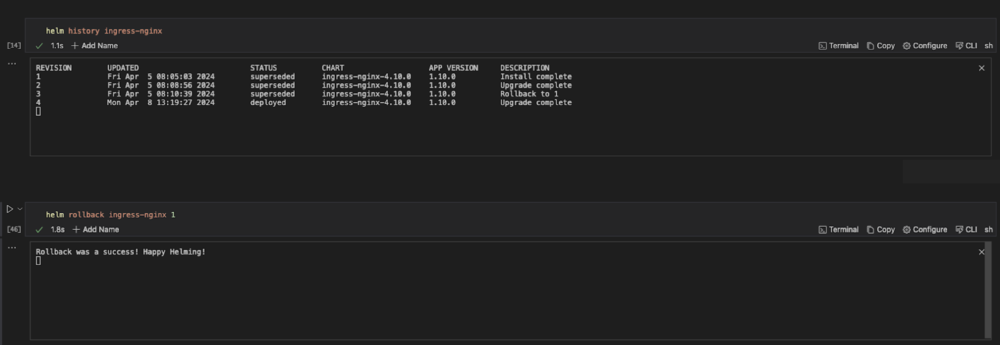

# Runme Integration with Helm

Helm is a package manager for Kubernetes, an open-source orchestration platform. It assists users in defining, installing, and managing applications and their dependencies on a Kubernetes cluster. Conversely, Runme is an IDE that converts Markdown files into executable notebooks. Both platforms aim to simplify users' deployment processes.

Runme is designed to enhance communication between teams and facilitate knowledge sharing. It has the technical capability to execute your code or deploy your application, and it is accompanied by clear documentation that everyone can comprehend.

This guide demonstrates how to integrate Helm with Runme. This integration simplifies and documents your deployments, improves consistency, and enhances collaboration between development and operations teams.

## **Prerequisite**

- Have a running Kubernetes Cluster ( for this guide, I will be using kind)
- Have Docker running
- Install and configure Helm.
- Notebook

Follow the instructions and commands in the above notebook for this guide.

## **Helm Chart Repository**

This collection comprises packaged Helm charts for easy discovery, distribution, and installation. In the `Helm Repo` section of this notebook, we guide you on how to add a repo to your local Helm configuration. We also show you how to list the charts in your repo and search through them to select the specific chart you need.

For this guide, The repo adds a Kubernetes Ingress controller called `ingress-nginx` it helps manage external access to services within the Kubernetes cluster.

with the Rume, you can run the [entire markdown file](https://docs.runme.dev/configuration/document-level#run-all-button), a single code cell, or Just a section of your markdown

<video autoPlay loop muted playsInline controls>
  <source src="/videos/runme-section.mp4" type="video/mp4" />
  <source src="/videos/runme-section.webm" type="video/webm" />
</video>

## **Helm Install : Installing packages**

The `helm install` command installs a Helm chart into your Kubernetes cluster. When you run `helm install`, you specify the release name, the chart name (either local or from a repository), and any necessary configuration values or overrides. Helm fetches the specified chart from the repository (if not already locally available) and installs it into your cluster, creating a new release.

the `helm install` section of this guide installs the  Kubernetes Ingress controller & checks the status of the deployment to make sure everything is installed appropriately.


To uninstall Ingress Controller :

```sh
helm uninstall ingress-nginx
```

## **Helm Upgrade**

`helm upgrade` is a Helm command used to upgrade a release to a new version of a chart or to apply changes to an existing release. It allows you to modify the configuration, resources, or versions associated with a Helm release in your Kubernetes cluster.

IIn this guide, I expanded the replica set of my Ingress controller to 3 and customized my `values.yaml`.

With Runme, you can modify the [working directory](https://docs.runme.dev/configuration/cell-level#cells-current-working-directory) for your code cell to a file directory of your choice. This enables you to easily run `values.yaml` even if the file is not located in the same directory as your markdown file.

```sh
helm upgrade ingress-nginx ingress-nginx/ingress-nginx --values values.yaml
```

To check the status of your deployment

```sh
helm status ingress-nginx
```

## **Helm Rollback**

`helm rollback` is a Helm command used to roll back a release to a previous version. It allows you to revert to a specific historical version of a Helm release in your Kubernetes cluster. Here’s how `helm rollback`



```sh
helm status ingress-nginx
```

## **Helm Get**

The `helm get` command in Helm is used to retrieve information about a specific release or resource within a release. It provides various subcommands to fetch different types of information related to Helm releases.

```sh
helm get manifest ingress-nginx
```

### **Helm Plugin**

Helm plugins are external tools or extensions that enhance the functionality of the Helm CLI. Plugins allow users to extend Helm’s capabilities by adding new commands or features without modifying the core Helm codebase.

For this guide, we installed the sops plugin to use it encrypt our kubernetes secret


```sh
helm secrets encrypt secrets.yaml > sops-secrets.yaml
```

Using Runme can give your documentation a fresh look. It provides a platform to share knowledge, test, and execute documented tasks, leading to easier knowledge sharing among teams. Additionally, integrating Runme with Helm enhances the management of your Kubernetes applications.
