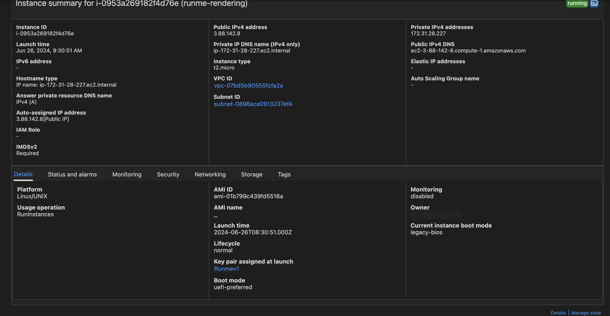
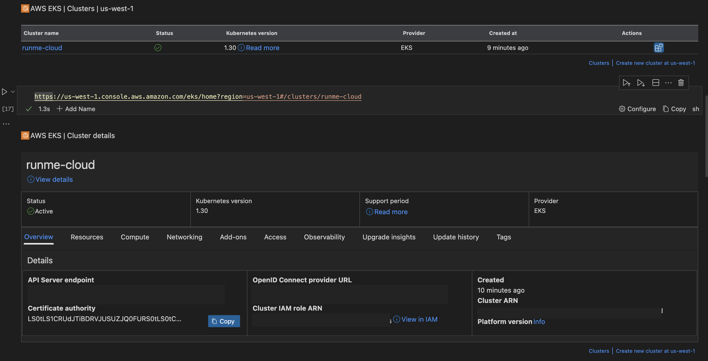

---
runme:
  id: 01J1ASZDP12DG2YF681CEAEHY3
  version: v3
title: Runme Cloud Renders with AWS
---

# Runme Cloud Renderers with AWS

Runme Cloud Rendering allows users to interact with cloud resources directly from their Markdown file. It integrates with various cloud services, including [AWS Elastic Cloud Compute (EC2)](https://aws.amazon.com/ec2/) and [AWS Elastic Kubernetes Service](https://aws.amazon.com/eks/).

While AWS EC2 is a cloud-based service that allows users to deploy, manage, and scale applications efficiently while optimizing costs and ensuring security, AWS EKS, on the other hand, is a managed Kubernetes service that makes it easy to run Kubernetes on AWS without installing and operating your own Kubernetes control plane or nodes.

The integration of Runme with AWS makes it easy to scale applications from your Markdown file and promotes collaboration between teammates.

This guide will explore how to accelerate your workflow by leveraging Runme Cloud Rendering with AWS.

## Installation

**Install AWS CLI:** For UNIX-based systems (macOS and Linux), you can use `Homebrew` to install `awscli`. To do that, run the command below:

```bash {"id":"01J1FHEZWX220HQZ4T5GEKWTH0"}
brew install awscli
```

To install on other platforms, check out the AWS [documentation](https://docs.aws.amazon.com/cli/latest/userguide/getting-started-quickstart.html).

## Getting Started

This section will explore setting up your AWS profile, listing configured profiles, and configuring any profie you want.

### Setting Up Your Working AWS Profile

After installing the AWS CLI, it stores your configuration settings and credentials in files.

Within a credentials file, information is organized into profiles, each potentially holding data such as your **AWS Access Key ID** and **AWS Secret Access Key**.

**List Configured Profiles**

You can create as many profiles as you need to execute your task. Each profile has a unique set of credentials and configuration settings. To get a list of configured profiles, run the command below.

```bash {"id":"01J1ASZDP12DG2YF680YG0KB06"}
aws configure list-profiles
```

When this command is executed, it will display a list of all profile(s) configured to your AWS CLI.


Apart from just listing profiles, you may want to get explicit profile details such as access key, secret key, etc.

To do this, you must first ensure you set the profile name of the specific profile you wish to display. [Runme’s environment variable prompt](https://docs.runme.dev/configuration/cell-level#set-environment-variables) makes this easy, as it prompts you to enter the profile name. To see this in action, run the command below.

```bash {"id":"01J1ASZDP12DG2YF680ZWS9MEQ"}
export PROFILE_NAME="default"
echo "PROFILE NAME SET TO $PROFILE_NAME"
```

This command sets the environment variable `PROFILE_NAME` to "default". You can replace "default" with any other configured profile name.

Once this command is executed, it will return the current value of the `PROFILE_NAME` variable to confirm it has been set correctly. The output will be:


Next, execute this command below to get the full details of your profile.

```bash {"id":"01J1ASZDP12DG2YF6811CEN9W8"}
aws configure list --profile $PROFILE_NAME
```

When that is successful, you will get an image similar to this.


**Configuring a Default Profile**

If you haven't configured a profile yet, you can create a default one by running the command below. Ensure you have your Access Key ID and Secret Access Key because you will be prompted to enter them.

```bash {"id":"01J1ASZDP12DG2YF6813G1SR6N"}
aws configure
```

Here is a visual representation of the output.


Your AWS CLI is correctly configured, and you can proceed to the next section.

## Working With EC2 Instances

AWS EC2 enables you to deploy cloud-native applications with high performance and security. In the sections below, you will discover how to leverage Runme Cloud Rendering to engage with your EC2 resources.

### List EC2 Instances

Listing EC2 instances is a crucial part of managing your AWS environment, and it serves as a foundation for performing other operations, such as managing instance states or securely connecting via SSH.

Runme integrates with your AWS EC2 resource URLs, mirroring your navigation in the AWS Console directly within your Notebook. This provides you with more focus as you get all its functionality within your Notebook.

To list your EC2 Instances, run the command below

Note: Replace the `[region]` with your actual region.

```bash {"id":"01J1ASZDP12DG2YF6816BNW44M"}
https://[region].console.aws.amazon.com/ec2/home?region=[region]#Instances
```

When this command is executed in your Runme code cell, the output is given below. If you would like to view your AWS console, you can click any of the highlight links indicated in the output image below.


### Get Specific EC2 Instance

With Runme Cloud Rendering, you can get specific instance details right inside your Notebook with a single click. To do this, follow the steps below.

- Ensure you have generated a list of your EC2 instances. If you haven’t go back to the previous step and do that.
- In the dashboard that appears in your Notebook, click the button as indicated in the image.

If you have more than one instance displayed, be sure to navigate to the specific instance and click that button.


- This will open a new view in your VS Code that prompts you to confirm your decision. Click Yes.


- Once your decision is confirmed, a new code block will be created in your Notebook and automatically run to generate the display. The code cell will look like this:

```bash {"id":"01J1FJ4FG6JB28J9445QT3A7GJ"}
https://us-east-1.console.aws.amazon.com/ec2/home?region=us-east-1#InstanceDetails:instanceId=$EC2_INSTANCE_ID
```

- After the code cell is run automatically and successfully executed, your Instance will be displayed.



This will unlock the visual display of the specific EC2 instance, which will give details of the instance ID, launch time, platform, availability zone, security groups, etc. You will also find useful links to the AWS Console like details and manage state.

### Connect to EC2 instance via SSH

SSH is essential for securely accessing, managing, and troubleshooting EC2 instances, thus giving you efficient and effective control over your cloud resources.

You can establish a secure SSH connection to an EC2 instance right inside your Markdown file. To do that, follow the steps below:

- Ensure you have generated a list of your EC2 instances. If you haven’t go back to the previous step and do that.
- In the dashboard that appears in your Notebook, click the button as indicated in the image.

If you have more than one instance displayed, be sure to navigate to the specific instance and click that button.


- This will open a new view in your VS Code that prompts you to confirm your decision. Click Yes.


- Once your decision is confirmed, a new code block will be created in your Notebook and automatically run to SSH into the instance. This is the code block created and the final output to confirm that it operation was successful.


## Working with EKS Clusters

In this section, you will discover how you can leverage Runme's Cloud Rendering to engage with your EKS resources in ways you've never imagined before!

### List EKS Clusters

One of the fundamental tasks when working with EKS is listing your clusters. This is important because it helps you view your cluster status and is a starting point for other actions, such as viewing and retrieving their cluster details and ensuring your Kubernetes environment is running smoothly.

Runme easily connects with your AWS EKS resources, letting you navigate them directly within your Notebook, just like in the AWS Console. This means you don't need to open the AWS Console separately; you can do everything right from your Notebook.

To test out this action, run the command below:

```bash {"id":"01J1FQD2AXH8VQQYH15EKJMN8X"}
export EKS_REGION="us-east-1"
echo "EKS_REGION set to $EKS_REGION"
```

**Note: Ensure to set your region.**

When this command is executed, this is the output interface.


Next, run the command below to experience the Runme Cloud Rendering in action.

```bash {"id":"01J1FQEDEXFFKERZ3NZ1CK9A1H"}
https://$EKS_REGION.console.aws.amazon.com/eks/home?region=$EKS_REGION#/clusters
```

This is the resulting interface. Isn’t it cool? You can view comprehensive information about the cluster by clicking on the action button (highlighted in the image).


This will direct you to your EKS cluster detail page.



### Get Specific EKS Cluster Details

Another important operation with the Runme Cloud Rendering is viewing details of a specific EKS cluster using the AWS console link.

**How does this work?**

When you execute an AWS console link. Here is a sample of an AWS console link:

```sh {"id":"01J1FQKDWC9EM7BBTVTYN0X1V7"}
https://[Region].console.aws.amazon.com/eks/home?region=[Region]#/clusters/[Cluster-name]
```

**Remember:** Replace the `Region` and `Cluster-name` name with the right credentials to have access to your cluster.

Runme provides a detailed view similar to listing EKS clusters. This view includes comprehensive information about the cluster and makes it easy to understand and manage its settings and status.

Alternatively, you can access specific details of your EKS cluster by running the command below:

```sh {"id":"01J1FQMBNHJ5BGW5PEFMDWD0WY"}
export EKS_CLUSTER="dev1"
export EKS_REGION="us-east-1"
echo "EKS_CLUSTER set to $EKS_CLUSTER"
echo "EKS_REGION set to $EKS_REGION"
```

As in the image below, be sure to replace the cluster placeholder with the instance you want to visualize.


Next, run this command:

```sh {"id":"01J1FQNKT62ZGXB3T0HHQRE79Z"}
https://$EKS_REGION.console.aws.amazon.com/eks/home?region=$EKS_REGION#/clusters/$EKS_CLUSTER
```

This will return the comprehensive details of the specific EKS cluster. As seen below:


If you would love to navigate to the AWS console for that cluster, click the view details icon as indicated in the image above.

## Feedback and Contribution

We are still developing more features for the Runme Cloud Renderers. If you have feedback on this or new ideas on how to improve this feature, feel free to [reach out to us](https://github.com/stateful/runme?tab=readme-ov-file#feedback).
